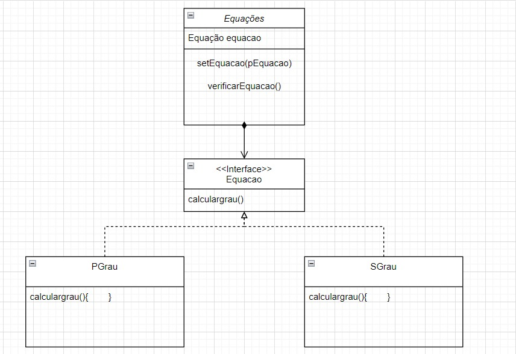
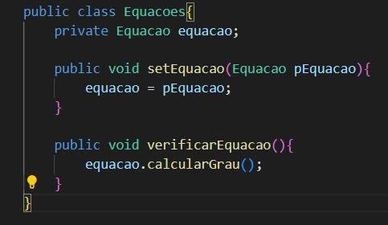
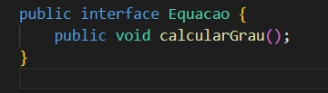
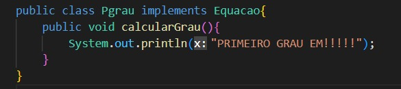
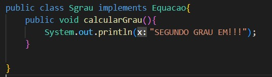

https://refactoring.guru/pt-br/design-patterns

# Diagrama
<section align="center">
  </img>
</section>

# Código
<section align="center">

 

 

 

</section>
<a href="./atvI.rar">Código.rar</a>
