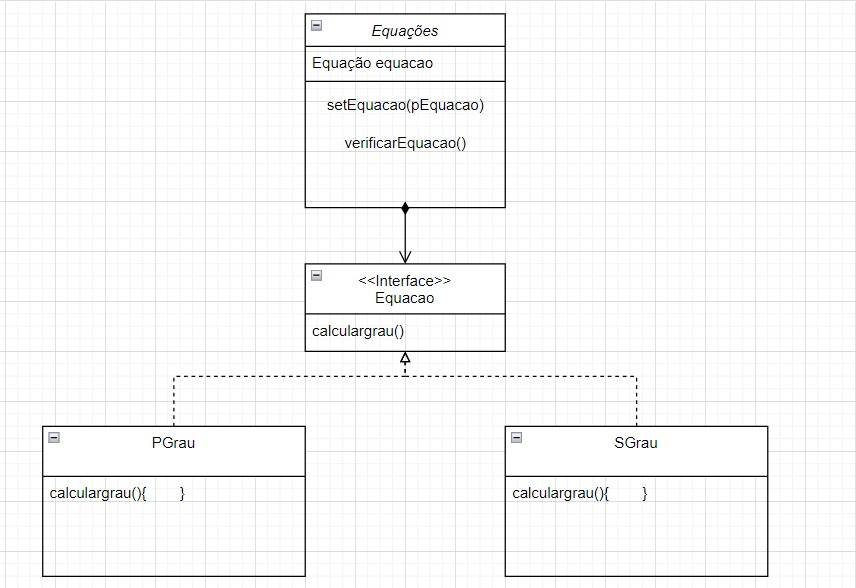
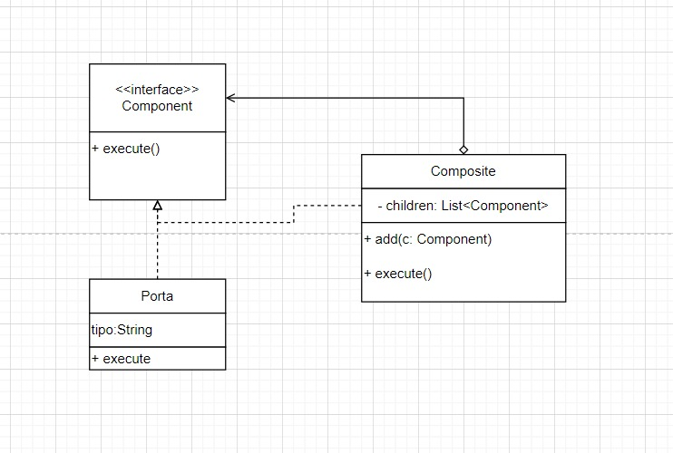

# Diagramas dos projetos.

## Diagrama Strategy
<section align="center">
  </img>
</section>

## Diagrama Strategy II
<section align="center">
  </img>
</section>

## Diagrama Observer
<section align="center">
  </img>
</section>

## Diagrama Composite
<section align="center">
  </img>
</section>

## Diagrama Singleton
<section align="center">
  </img>
</section>

## Diagrama Facade
<section align="center">
  </img>
</section>
