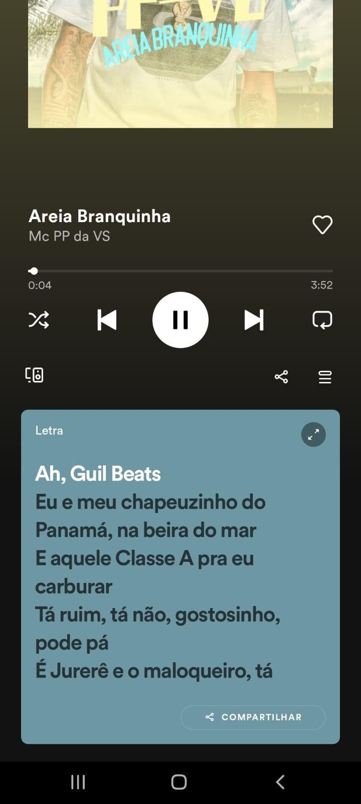

# Gabriel Coutinho Silva 1460482121036

# Heurística texto
# 1.1 Textos alternativos
### Site que aplica

Aqui mostra varias informações por imagens e também disponibilizam acesso ao site por linguagem de libras

### Site que não aplica

## Heurística vídeo 
## Mídia baseada em tempo

### Site que aplica

No caso as legendas são geradas automaticamente de acordo com a fala de cada personagem.

### Site que não aplica

##1.3 Adaptável
Crie conteúdo que possa ser apresentado de diferentes maneiras (por exemplo, layout mais simples) sem perder informações ou estrutura. Um recurso da adaptabilidade é a Orientação. Alguns sites e aplicativos exigem que os usuários orientem seus dispositivos móveis em modo paisagem ou retrato, em vez de dar-lhes uma escolha.
Um bom exemplo disso é o site do WOW sendo responsivo:
## Desktop
<section align="center">
    
</section>

## Celular
<section align="center">
    
</section>

### 1.2 Mídia baseada no tempo
Forneça alternativas para mídia baseada no tempo.

Qualquer conteúdo pré-gravado que contenha uma faixa de áudio (seja apenas áudio ou vídeo) deve possuir legenda.

Um bom exemplo disso é o Spotify que coloca as letras das músicas enquanto as mesmas tocam:

<section align="center">
    
</section>

### 1.3 Adaptável
Crie conteúdo que possa ser apresentado de diferentes maneiras (por exemplo, layout mais simples) sem perder informações ou estrutura.
Um recurso da adaptabilidade é a Orientação.
Alguns sites e aplicativos exigem que os usuários orientem seus dispositivos móveis em modo paisagem ou retrato, em vez de dar-lhes uma escolha. A intenção desse critério de sucesso é garantir que os usuários que não podem rodar facilmente seu dispositivo ainda possam acessar conteúdo e funcionalidade em sites em qualquer orientação do dispositivo.

Um bom exemplo disso é a Blizard que fez o site do WOW ser responsivo, isto é, faz com que sua página da web fique bem em todos os dispositivos e ainda se adeque no modo retrato e paisagem.

<section align="center">
     
    
</section> 

### 1.4 Distinguível
A intenção deste Critério de Sucesso é garantir que todos os usuários com visão possam acessar informações que são transmitidas por diferenças de cor, ou seja, pelo uso de cor onde cada cor tem um significado atribuído a ela. Se as informações forem transmitidas por diferenças de cor em uma imagem (ou outro formato não-texto), a cor pode não ser vista por usuários com deficiências de cor. Neste caso, fornecer as informações transmitidas com cor através de outro meio visual garante que os usuários que não podem ver a cor ainda possam perceber as informações.

A cor é um importante ativo no design de conteúdo web, aumentando seu apelo estético, sua usabilidade e sua acessibilidade. No entanto, alguns usuários têm dificuldade em perceber a cor. Pessoas com visão parcial muitas vezes experimentam visão de cores limitada, e muitos usuários mais velhos não vêem bem a cor. Além disso, as pessoas que usam displays de cores limitadas ou monocromáticas e navegadores não poderão acessar informações que são apresentadas apenas em cores.

Um bom exemplo desse recurso é quando esquecemos de preencher algum campo obrigatório de um formulário:

<section align="center">
    
</section>

## 2. Operável
Os componentes da interface do usuário e a navegação devem ser operáveis.

### 2.1 Teclado acessível
Usuários que interagem com seus dispositivos através da fala muitas vezes usam palavras ou strings de letras para fazê-lo. Aplicativos e sites que usam comandos de teclado de letras únicas para ativar funções podem ser frustrantes ou não funcionais para esses usuários, porque ditar uma palavra pode ter consequências totalmente não intencionais. Dar aos usuários a capacidade de desligar, remapear ou limitar a ativação desses atalhos retorna funcionalidade a esses usuários.

Um bom exemplo desse recurso é o uso dos atalhos de teclado: 

<section align="center">
    
</section>

### 2.2 Tempo suficiente
Forneça aos usuários tempo suficiente para ler e usar conteúdo.
Qualquer elemento na tela que tenha movimento automático ou pisque e que dure mais do que 5 segundos, deve ter um tipo de controle onde a pessoa que o utiliza pode pausar, parar ou ocultar. 

Um bom exemplo desse recurso é o botão de pause que o Spotify oferece: 

<section align="center">
    
</section>

### 2.3 Convulções e Reações Físicas
Não projete conteúdo de forma conhecida por causar convulsões ou reações físicas.
Nenhum conteúdo da página deve piscar mais que 3 vezes por segundo, a não ser que os flashes estejam em baixo contraste ou possuam pouco vermelho.

### 2.4 Navegável
Fornecer maneiras de ajudar os usuários a navegar, encontrar conteúdo e determinar onde eles estão.
Um mecanismo está disponível para contornar blocos de conteúdo que são repetidos em várias páginas da Web. 

Um bom exemplo disso é o menu do WOW, que está presente em todas as páginas que o usuário possa acessar do site.

<section align="center">
    
</section>

## 3 - Compreensível
As informações e o funcionamento da interface do usuário devem ser compreensíveis.
### 3.1 Legível
Palavras regionais específicas e nomes próprios costumam ter pronúncias também específicas. Deve ser fornecida uma forma de possibilitar a correta compreensão da pronúncia em alguns casos.

Um bom exemplo disso é o wikipédia, que disponibiliza um arquivo de áudio exemplificando como deve ser a pronúncia: 

<section align="center">
    
</section>

